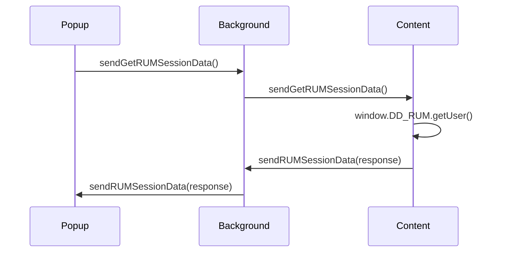

# Messaging in Chrome Extension

This document explains the messaging architecture used in the Datadog Sales Engineer Toolkit Chrome Extension. The extension uses the `@extend-chrome/messages` package to facilitate communication between various parts of the extension—background scripts, content scripts, and popup interfaces.

## Overview

The extension needs to handle a variety of communication scenarios, like validating credentials, injecting scripts, and retrieving Datadog RUM session data. Each of these scenarios uses a specific message channel, which defines the data structure and method of communication.

## Core Concepts

### Message Types

Messages are essentially events that encapsulate a specific data structure and are sent between different components of the extension. For each feature, a message type is defined that outlines the expected request and response formats.

### Messaging Pattern

Using the `@extend-chrome/messages` library, the extension can send and receive messages with type safety and a clean API. Each message type has:

- **send**: Function to dispatch a message.
- **stream**: Observable to subscribe to incoming messages of that type.
- **waitFor**: Promise that resolves when a message of that type is received.

### Debug Logging

To help with development and debugging, the project includes a debug logging function that outputs the operation type, message, and data to the console.

```typescript
const debugLog = (operation: string, messageType: string, data?: any) => {
  console.log(`[Messages Debug] ${operation} - ${messageType}`, data);
};
```

## Message Examples

### Credential Validation

Handles API key validation for Datadog:

```typescript
export interface ValidateCredentialsRequest {
  credentials: DatadogCredentials;
}

export const sendValidateCredentials = (data: ValidateCredentialsRequest) => {
  debugLog('SENDING', 'VALIDATE_CREDENTIALS', data);
  return _sendValidateCredentials(data);
};
```

### RUM Session Data

Fetches Datadog RUM user session data from the window object:

```typescript
export interface RUMSessionData {
  sessionId?: string;
  userId?: string;
  ...
}

export const [sendGetRUMSessionData, getRUMSessionDataStream, waitForGetRUMSessionData] = 
  getMessage<void>('GET_RUM_SESSION_DATA');
```

## Use Case: Display RUM Data in Popup

To display RUM user session data in the popup, the extension sends a message from the popup to the content script using the background script as an intermediary.

### Sequence of Events

1. **Popup Component** sends a `GET_RUM_SESSION_DATA` message to the background.
2. **Background Script** forwards this message to the content script.
3. **Content Script** fetches data using `window.DD_RUM.getUser()` and sends a response back.
4. **Popup Component** receives the response and displays it.

## Diagram

Below is a Mermaid.js diagram illustrating the message flow:



## Best Practices

1. **Separate Message Channels**: Use distinct message types for different operations to maintain clarity and ease of debugging.
2. **Type Safety**: Define interfaces for message data to leverage TypeScript’s type checking.
3. **Verbose Logging**: Utilize debug logging for tracking message flow during development.

This structured approach to messaging helps maintain clean, scalable, and efficient communication across different parts of the Chrome extension.